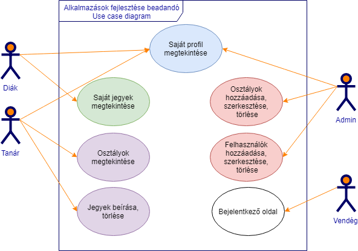

# Frontend dokumentáció

## Használati eset diagram: melyik szerepkör mely felületekhez fér hozzá


## Fejlesztői környezet bemutatása, beállítása
Fejlesztői környezetnek a Microsoft Visual Studio Code-t választottuk, a fejlesztést pedig Windows 10 rendszeren végeztük.

Az Visual Studio Code ingyenesen letölthető innen: [https://code.visualstudio.com/](https://code.visualstudio.com/)

Valamint szükséges a Git beszerzése is: [https://git-scm.com/downloads](https://git-scm.com/downloads)

A fenti programokat értelemszerűen és az igényeknek megfelelően telepíteni kell. Célszerű a Visual Studio Code-ban az egész frontend mappát megnyitni, ha fejleszteni szeretnénk.

A frontedhez telepíteni kell a függőségeket az alábbi paranccsal:
```
npm install
```
Majd ezt követően az alábbi paranccsal indítható:
```
ng serve
```
Miután elindult, a módosításokat automatikusan alkalmazza. Tehát nem kell minden módosítás után újraindítani a frontendet.

### Az Angular által generált leírás:
This project was generated with [Angular CLI](https://github.com/angular/angular-cli) version 6.2.5.

#### Development server

Run `ng serve` for a dev server. Navigate to `http://localhost:4200/`. The app will automatically reload if you change any of the source files.

#### Code scaffolding

Run `ng generate component component-name` to generate a new component. You can also use `ng generate directive|pipe|service|class|guard|interface|enum|module`.

#### Build

Run `ng build` to build the project. The build artifacts will be stored in the `dist/` directory. Use the `--prod` flag for a production build.

#### Running unit tests

Run `ng test` to execute the unit tests via [Karma](https://karma-runner.github.io).

#### Running end-to-end tests

Run `ng e2e` to execute the end-to-end tests via [Protractor](http://www.protractortest.org/).

#### Further help

To get more help on the Angular CLI use `ng help` or go check out the [Angular CLI README](https://github.com/angular/angular-cli/blob/master/README.md).

## Használt technológiák 
- TypeScript nyelv
- Angular 6 keretrendszer
- Materialize keretrendszer (ngx-materialize)

## Alkalmazott könyvtárstruktúra bemutatása
A frontend mappa az alábbi könyvtárstruktúrát tartalmazza.
```
+---e2e
|   \---src
\---src
    +---app
    |   +---components
    |   |   +---admin-register-user-view
    |   |   +---admin-start-page-view
    |   |   +---logged-out-view
    |   |   +---login-view
    |   |   +---profile-view
    |   |   +---student-profile-view
    |   |   +---start-page-view
    |   |   +---student-subject-item-view
    |   |   +---student-subject-list-view
    |   |   \---teacher-main-view
    |   +---models
    |   +---routing
    |   \---services
    +---assets
    |   \---static
    |       +---favicons
    |       \---images
    \---environments
```